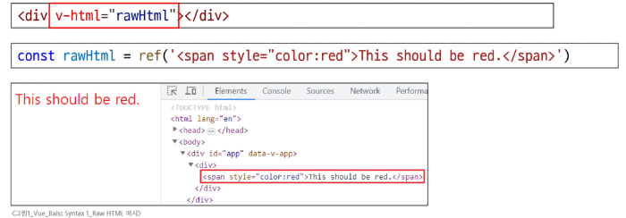
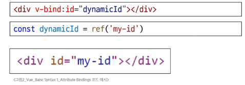
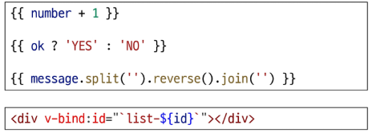
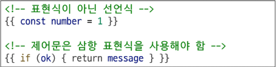

# Template Syntax

- Vue는 DOM을 컴포넌트 인스턴스의 데이터에 선언적으로 바인딩 할 수 있는, HTML 기반 템플릿 구문을 사용
  - 선언적 바인딩 : JavaScript 데이터(상태)가 바뀌면 DOM(화면)이 알아서 업데이트 되는 것
  - 템플릿 구문 : HTML에 Vue만의 특별한 문법을 추가해서 사용하는 것을 의미

## Template Synatax 종류

- Text Interpolation
- Raw HTML
- Attribute Bindings
- JavaScript Expressions

1. Text Interpolation

- 데이터 바인딩의 가장 기본적인 형태
  - 데이터 바인딩 : 자바스크립트 데이터와 HTML 화면을 동기화하여 연결하는 것
- 이중 중괄호 구문(콧수염 구문)을 사용
- 콧수염 구문은 해당 컴포넌트 인스턴스의 msg 속성 값으로 대체
- msg 속성이 변경될 때마다 업데이트 됨

2. Raw HTML

- 콧수염 구문은 데이터를 일반 텍스트로 해석하기 때문에 실제 HTML을 출력하려면 v-html을 사용해야 함
  

3. Attribute Bindings

- 콧수염 구문은 HTML 속성 내에서 사용할 수 없기 때문에 v-bind를 사용
- HTML의 id 속성 값을 vue의 dynamicid 속성과 동기화 되도록 함
- 바인딩 값이 null이나 undefind인 경우, 해당 속성은 렌더링 요소에서 제거됨
  

4. JavaScript Expressions

- Vue는 모든 데이터 바인딩 내에서 JavaScript 표현식의 모든 기능을 지원
- Vue 템플릿에서 JavaScript 표현식을 사용할 수 있는 위치 1. 콧수염 구문 내부 2. 모든 디렉티브의 속성 값('v-'로 시작하는 특수 속성)
  

## Expressions 주의사항

- 각 바인딩에는 하나의 단일 표현식만 포함될 수 있음
  - 표현식은 값으로 평가할 수 있는 코드 조각(return 뒤에 사용할 수 있는 코드여야 함)
- 작동하지 않는 경우
  

--

# Directive

- 'v-'접두사가 있는 특수 속성
- Directive는 'v-'접두사를 가진 특수 속성으로, DOM 요소에 특정 반응형 동작을 적용하는 명령어
- v-if는 조건에 따라 렌더링하고, v-for는 배열을 반복 출력하는 등 다양한 반응형 동작을 연결
- 즉, JavaScript 로직을 HTML 템플릿 안에서 선언적으로 사용하여, 코드를 깔끔하고 직관적으로 유지하는데 도움을 주는 Vue의 강력한 도구

## Directive 특징

- Directive의 속성 값은 단일 JavaScript 표현식이어야 함(v-for, v-on 제외)
- 표현식 값(ex: "seen")이 변경될 때 DOM에 반응적으로 업데이트를 적용

## Directive 전체 구문

- Name(이름) : Directive의 핵심 이름으로, 어떤 종류의 기능을 수행할지를 의미
- Argument(전달 인자) : Directive가 '무엇에 대해' 동작할지 알려주는 구체적인 대상
- Modifiers(수식어) : 점으로 표시되는 특별한 접미사로, Directive의 기본 동작을 수정할 수 있음
- Value(값) : Directive에 연결된 JavaScript 표현식

## Directive: "Arguments"

- 일부 directive는 directive 뒤에 콜론(":")으로 표시되는 인자를 사용할 수 있음
- 아래 예시의 href는 HTML `<a>`요소의 href 속성 값을 myUrl 값에 바인딩 하도록 하는 v-bind의 약자

```Vue
<a v-bind:href='myUrl'>Link</a>
```

- 아래 에시의 click은 이벤트 수신할 이벤트 이름을 작성하는 v-on의 인자

```Vue
<button v-on:click='doSomething'>Button</button>
```

## Directive: "Modifiers"

- ".(dot)"로 표시되는 특수 접미사로, directive가 특별한 방식으로 바인딩되어야 함을 나타냄
- 예시의 .prevent는 발생한 이벤트에서 event.preventDefault()를 호출하도록 v-on에 지시하는 modifier

```Vue
<form v-on:submit.prevent="onSubmit">
    <input type='submit'>
</form>
```
