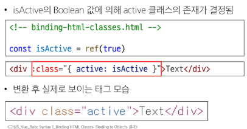
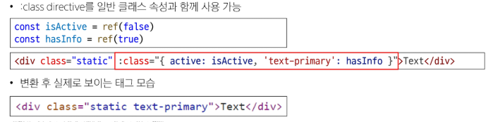
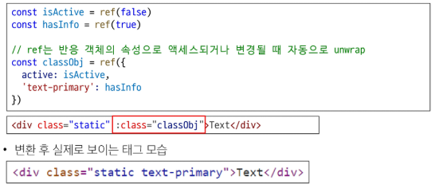
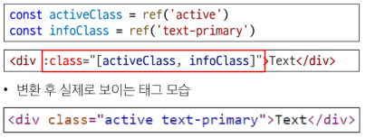
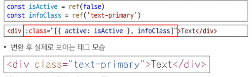
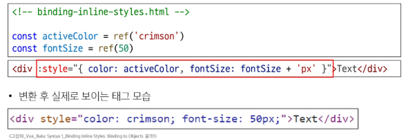
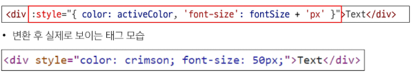
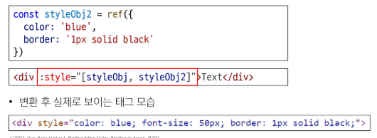

# Dynamically data binding

## v-bind

- 하나 이상의 속성 또는 컴포넌트 데이터를 표현식에 동적으로 바인딩
- HTML 태그의 속성을 Vue의 데이터와 실시간으로 연결해 동적으로 제어하는 directive

# Attribute Bindings (속성 바인딩)

- HTML의 속성 값을 Vue의 상태 속성 값과 동기화

```Vue

<a v-bind:href='myUrl'>Move to url</a>
```

- v-bind shorthand(약어)
  -':'(콜론)

```vue

<a :href="myUrl">Move to url</a>
```

# Dynamic attribute name (동적 인자 이름)

- 대괄호([])로 감싸서 directive argument에 JavaScript 표현식을 사용할 수 있음
- 표현식에 따라 동적으로 평가된 값이 최종 argument 값으로 사용됨

```Vue
<button :[key]='myValue'></button>
```

# Class and Style Bindings (클래스와 스타일 바인딩)

- class와 style은 모두 HTML 속성이므로 다른 속성과 마찬가지로 v-bind를 사용하여 동적으로 문자열 값을 할당할 수 있음
- Vue는 class 및 style 속성 값을 v-bind로 사용할 때 객체 또는 배열을 활용하여 작성할 수 있도록 함
  - 단순히 문자열 연결을 사용하여 이러한 값을 생성하는 것은 번거롭고 오류가 발생하기가 쉽기 때문

# Class and Style Bindings가 가능한 이유

- Binding HTML Classes
  - 1.1 Binding to Objects
  - 1.2 Binding to Arrays
- Binding Inline Styles
  - 2.1 Binding to Objects
  - 2.2 Binding to Arrays

## 1.1 Binding HTML Classes : Binding to Objects

- 객체를 :class 에 전달하여 클래스를 동적으로 전환 할 수 있음
  

- 객체에 더 많은 필드를 포함하여 여러 클래스를 전환 할 수 있음
  

- inline 방식이 아닌 반응형 변수를 활용해 객체를 한번에 작성하는 방법
  

## 1.2 Binding HTML Classes: Binding to Arrays

- :class 를 배열에 바인딩하여 클래스 목록을 적용할 수 있음
  
- 배열 구문 내에서 객체 구문을 사용하는 경우
  
  --

## 2.1 Binding Inline Styles : Binding to Objects

- :style은 HTML의 style속성에 JavaScript 객체를 바인딩하는 것을 지원
  
- 실제 CSS에서 사용하는 것처럼 :style은 kebab-cased 키 문자열도 지원 (단, camelCase 작성을 권장)
  
- inline 방식이 아닌 반응형 변수를 활용해 객체를 한번에 작성하는 방법
  

## 2.2 Binding Inline Styles : Binding to Arrays

- 여러 스타일 객체를 배열에 작성해서 :style을 바인딩 할 수 있음
- 작성한 객체는 병합되어 동일한 요소에 적용
  
