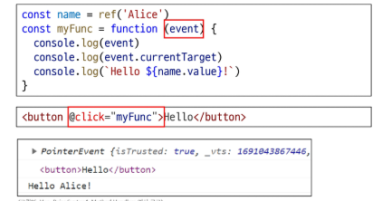
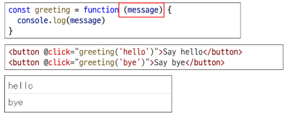
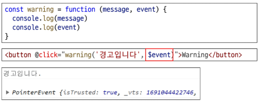
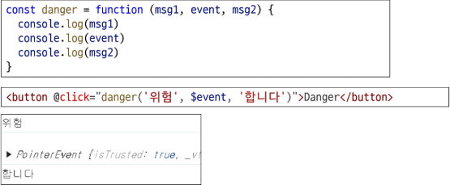

# 이벤트 핸들링

--

# v-on

- DOM 요소에 이벤트 리스너를 연결 및 수신
- 사용자와 웹 페이지가 서로 상호작용 할 수 있도록 만드는 핵심적인 역할을 하며, 버튼을 누르면 A를 실행하세요 와 같은 로직을 구현

## v-on 구성

- DOm 요소에 이벤트 리스너를 연결 및 수신

```vue
v-on:event='handler'
```

- v-on shorthand (약어)

  - @

  ```Vue
    @event='handler'
  ```

- handler 종류
  1. Inline handlers : 이벤트가 트리거 될 때 실행 될 JavaScript 코드
  2. Method handlers : 컴포넌트에 정의된 메서드 이름

### Inline handlers

- Inline handlers는 주로 간단한 로직에 사용
- 복잡한 표현식이 들어가면 템플릿이 지저분해지고 코드를 이해하기 어려워짐
- 재사용이 불가능해 유지보수가 어려움

```Vue
const count = ref(0)
<button @click='count++'>Add 1</button>
<p>Count : {{count}}</p>
```

### Method handlers

- 메서드 핸들러는 setup에 정의된 메서드를 호출하는 방식
- 로직이 복잡할 경우, Method를 분리하면 템플릿이 간결해지고 코드를 재사용하기 좋음
- inline handlers로는 불가능한 대부분의 상황에서 사용

```Vue
const increase = function (){
    count.value += 1
}
<button @click='increase'>Hello</button>
```

- @click='myFunc'처럼 괄호 없이 메서드 이름만 연결하면, 핸들러의 첫번째 인자로 DOM의 event객체가 자동으로 전달 됨
  

## 사용자 지정 인자 전달

- 기본 이벤트 대신 사용자 지정 인자를 전달 할 수도 있음
  
- -> event 객체도 인자로 같이 받고 싶을 때는 어떻게 할까?

## Inline Handlers 에서의 event 인자 접근

- Inline Handlers에서 원래 DOM 이벤트에 접근하기
- $event 변수를 사용하여 메서드에 전달
  

- $event 변수를 전달하는 위치는 상관 없음
  
