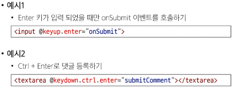
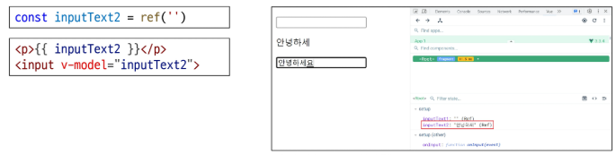
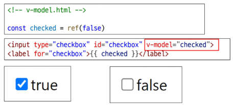
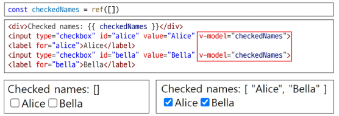
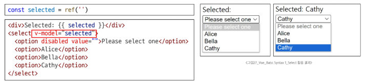

# Event Modifiers

- Vue는 Event Modifiers를 제공하여, event.preventDefault()와 같은 코드를 메서드 안에 직접 작성할 필요가 없도록 합니다.
- 대신 stop, prevent, self 등 다양한 modifiers제공
- 이는 메서드 로직을 순수하게 데이터 관련 처리에만 집중시키기 위함

```vue
<form @submit.prevent="onSubmit">...</form>
<a @click.stop.prevent="onLink">...</a>
```

## key Modifiers

- 키보드 이벤트를 수신할 때 특정 키에 관한 별도 modifiers를 사용할 수 있음
  

# Form Input Bindings (폼 입력 바인딩)

- form을 처리할 때 사용자가 input에 입력하는 값을 실시간으로 JavaScript 상태에 동기화해야 하는 경우(양방향 바운딩)
- 양방향 바인딩 방법
  1. v-bind와 v-on을 함께 사용
  2. v-model 사용

## v-bind와 v-on을 함께 사용

1. v-bind로 input 요소의 value속성을 반응형 변수에 연결
2. v-on으로 input 이벤트가 발생할 때마다, input의 현재 값을 반응형 변수에 저장

--

# v-model

- form input 요소 또는 컴포넌트에서 양방향 바인딩을 만듦
- input과 같은 폼 요소의 값과 Vue의 데이터를 실시간으로 동기화시키는 directive
- 사용자 입력 데이터와 반응형 변수를 실시간 동기화
  

## v-model과 다양한 입력(input) 양식

- v-model은 단순 Text input 뿐만 아니라 다양한 타입의 사용자 입력 방식과 함께 사용 가능
  - Checkbox
  - Select
  - Radio
  - textarea

### Checkbox 활용

1. 단일 체크박스와 boolean 값 활용
   
2. 여러 체크박스와 배열 활용
   - 초기 반응형 변수를 배열로 초기화
   - 해당 배열에는 현재 선택된 체크박스의 값이 포함됨
     

### Select 활용

- select에서 v-model 표현식의 초기 값이 어떤 option과도 일치하지 않는 경우, select 요소는 '선택되지 않은(unselected)' 상태로 렌더링 됨
  
