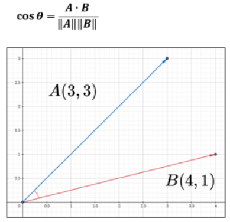
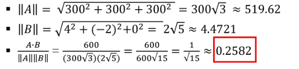
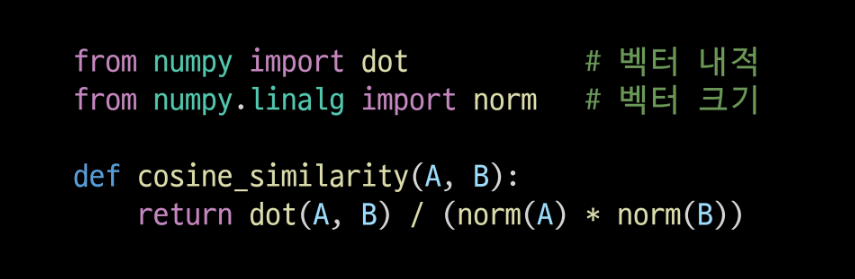

# 문서 유사도

- 여러 개의 문서(또는 문장)가 '얼마나 비슷한 내용(의미)'을 담고 있는지'를 수치로 표현한 것

# 문서 유사도 수치화 방법

- 자카드 유사도
  - 문서를 '단어의 집합'으로 보고, 공통으로 들어있는 '단어의 비율'을 계산 (공통 단어/전체 단어)
- 코사인 유사도
  - 문서를 백터로 표현한 뒤, 두 벡터가 이루는 '각도의 코사인 값'
  - -1 이상 1 이하의 값을 가지며 값이 1에 가까울수록 유사도가 높다고 판단(방향)
- 유클리드 거리
  - 문서를 벡터로 표현한 뒤, 두 벡터 사이의 '직선 거리'를 계산
  - 거리가 0에 가까울수록 유사도가 높다고 판단(거리)

## 코사인 유사도

- 벡터 공간에서 두 벡터가 '얼마나 같은 방향'을 향하고 있는 지를 나타내는 지표
- -1 이상 1 이하의 값을 가지며 값이 1에 가가울수록 유사도가 높다고 판단
  

## 벡터

- '방향과 크기'를 나타내는 수학적 표현
- 1차원 벡터, [v]
  - 실수선에서 한 점을 가리키는 화살표
- 2차원 벡터, [x,y]
  - 2D 평면에서 '오른쪽 x, 위로 y'을 가리키는 화살표
- 3차원 벡터, [x,y,z]
  - 3D 평면에서 'x축, y축, z축'을 가리키는 화살표
- 고차원 벡터, [v1,v2,v3,v4,...,v5]
  - N개의 실수 성분의 '크기와 방향'
  - 문서에 1000개의 단어가 있다면, 1000차원 벡터가 문서를 나타낸다고 볼 수 있음
- -> 문서나 데이터를 '크기와 방향'을 담는 벡터로 바꿔서 수치 구조로 바꿀 수 있음

## 내적

- 두 벡터가 얼마나 같은 방향으로 향해 있는지를 반영한 값
- 각 성분을 곱한 뒤 모두 더한 하나의 값
- 예)
  - 3차원에서 백터 A(3,3,3), B(4,-1,0)이 있을 때, A,B의 내적은?
    - A . B = (3*4) + (3 * -1) + (3 \* 0) = 12 + (-3) + (0) = 9
    - (3 \* 4) => 둘 다 양수, 즉 '같은 방향'으로 기여
    - (3 \* -1) => 하나가 음수, 즉 '반대 방향'으로 기여
    - (3 \* 0) => 하나가 0, 즉 방향이 없고, '무관'
  - => 전체적으로 두 벡터가 얼마나 같은 축 방향으로 뻗어 있는 지 알 수 있음

# 코사인 유사도

- 두 벡터가 쳐다보는 방향이 얼마나 유사한가를 확인
- 결국 코사인 유사도는 '크기'와는 무관하게 '방향'의 유사도를 확인
- 그러면 아래와 같은 경우에 내적을 구하면 올바른 코사인 유사도를 구할 수 있을까?
  - 3차원 벡터 A(300,300,300), B(4,-2,0)이 있을 때, A,B의 내적은?
    - A . B = (300 _ 4) + (300 _ -2) + (300 \* 0) = 1200 + (-600) + (0) = 600
  - A의 크기가 너무 크기 때문에 B의 영향은 너무 미비
  - 코사인 유사도는 '크기'가 아닌 '방향'이 얼마나 유사한지 보여주는 지표
  - => 크기를 고려하지 않기 위해서 두 벡터를 같은 크기(1)로 바꿔서 방향을 구하자

# 코사인 유사도(2)

- '크기'와는 무관하게 '방향'의 유사도를 확인하기 위해서, 정규화를 진행
- 내적으로 구한 값에 대해서 각 베터의 크기로 나누기
  - 벡터의 크기
    - 벡터가 원점으로부터 떨어져 있는 거리
- 3차원에서 백터 A(300, 300, 300), B(4, -2, 0)이 있을 때, A,B의 코사인 유사도는?
  - A . B = (300 _ 4) + (300 _ -2) + (300 \* 0) = 1200 + (-600) + (0) = 600
    

# 코사인 유사도(3)

- 두 벡터가 얼마나 같은 방향으로 향해 있는지를 반영한 값(두 벡터의 내적)
- 크기와 무관하게 '방향'만을 확인하기 위해 정규화 (각 벡터의 크기로 나누기)
- 아래와 같은 수식으로 코사인 유사도를 구할 수 있다
- 참고) '길이가 1인 벡터'끼리 내적을 하면, 두 벡터가 이루는 각도 θ의 코사인과 동일

## 코사인 유사도 참고(1/2)

- 코사인 유사도가 '크기'가 아닌 '방향'만 확인하는 이유

1. 검색/추천 에서 중요한 건 '어떤 단어/특징이 얼마나 중요한가?'이지, '몇 번 출현?'이 아님
   - 두 문서가 [10,5,0]과 [2,1,0]으로 단어 A,B등장 횟수를 가지면, '길이'는 A문서가 더 길지만, 비율은 동일하게 2:1로 볼 수 있음
2. 문서가 불필요하게 길어지거나 한 쪽의 출현 횟수만 늘려도, 패턴만 확인해서 비교할 수 있기 때문에 순서와 비율을 정확히 비교할 수 있음
3. -1 이상 1 이하 구간에서 해석이 가능해져 알고리즘 설계가 단순해짐
   
