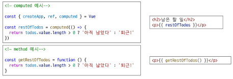

# computed
- 계산된 속성을 정의하는 함수

# computed를 사용하는 경우
- 반응형 데이터를 포함하는 복잡한 로직의 경우 computed를 활용하여 미리 값을 계산하여 계산된 값을 사용
- 여러 곳에서 사용해야 한다면, computed로 정의된 restOfTodos를 필요한 곳마다 재사용하면 됨

# computed 특징
- 반환되는 값은 계산된 ref(computed.ref)이며, 일반 ref와 유사하게 계산된 결과를 .value를 참조 가능(템플릿에서는 .value 생략 가능)
- computed 속성은 의존된 반응형 데이터를 자동으로 추적
- 의존하는 반응형 데이터가 변경될 때만 재평가
    - restOfTodos의 계산은 todos에 의존하고 있음
    - 따라서 todos가 변경될 때만 restOfTodos가 업데이트 됨

# computed와 동일한 로직을 처리할 수 있는 method
- computed 속성 대신 method로도 동일한 기능을 정의할 수 있음

# computed와 method 차이
- computed 속성은 의존하는 반응형 데이터를 기반으로 그 결과를 캐시(cashed)
- 의존하는 데이터가 변경된 경우에만 재평가됨
- 의존하는 데이터가 변경되지 않는 한, 해당 computed속성에 여러 번 접근해도 함수를 다시 실행하지 않고 캐시된 결과를 즉시 반환
- 반면, method 호출은 다시 렌더링이 발생할 때마다 항상 함수를 실행

# 캐시(Cashe)
- 데이터나 결과를 일시적으로 저장해두는 임시 저장소

## Cashe 예시 : 웹 페이지의 캐시 데이터
- 과거 방문한 적이 있는 페이지에 다시 접속할 경우
- 페이지 일부 데이터를 브라우저 캐시에 저장 후 같은 페이지에 다시 요청 시 모든 데이터를 다시 응답 받는 것이 아닌 일부 캐시 된 데이터를 사용하여 더 빠르게 웹 페이지를 렌더링

# computed와 method의 적절한 사용처
- computed
    - 의존하는 데이터에 따라 결과가 바뀌는 계산된 속성을 만들 때 유용
    - 동일한 의존성을 가진 여러 곳에서 사용할 때 계산 결과를 캐싱하여 중복 계산 방지

- method
    - 단순히 특정 동작을 수행하는 함수를 정의할 때 사용
    - 데이터에 의존하는지 여부와 관계없이 항상 동일한 결과를 반환하는 함수

# method와 computed 정리
- computed
    - 의존된 데이터가 변경되면 자동으로 업데이트
- method
    - 호출해야만 실행됨
- -> 무조건 computed만 사용하는 것이 아니라 사용 목적과 상황에 맞게 computed와 method를 적절히 조합하여 사용
