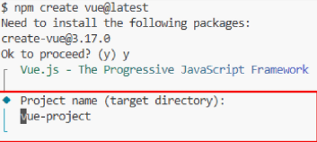
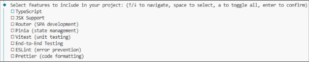
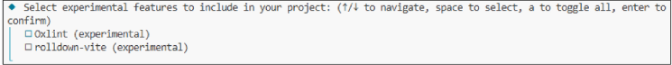
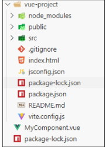

# Vue project 생성(1/7)
- Vue Project (Application) 생성 (vite 기반)
```npm
$ npm create vue@latest
```

# Vue project 생성(2/7)
- 프로젝트명 설정
    - tab 클릭시 기본 값 사용
    - enter 클릭 시 결정 후 진행


# Vue project 생성(3/7)
- 프로젝트에 추가 할 설정 선택
    - space 클릭 시 중복 선택 가능
    - enter 클릭 시 결정 후 진행


# Vue project 생성(4/7)
- 실험용 기능을 설치할 지 묻는 단계
    - 버그가 있거나 안정적이지 않을 수 있음
    - 해당 기능을 꼭 사용할 필요는 없음


# Vue project 생성(5/7)
- 프로젝트 생성 완료

# Vue project 생성(6/7)
- 프로젝트 폴더 이동
```vue
$ cd vue-project
```

- 패키지 설치
```vue
$ npm install
```

# Vue project 생성(7/7)
- vue 프로젝트 서버 실행
```vue
$ npm run dev
```

# Vue Project 기본구조
1. public 디렉토리
2. src 디렉토리
    1. src/assets
    2. src/components
    3. src/App.vue
    4. src/main.js
3. index.html
4. 기타 설정 파일
5. 패키지 관리 파일
    1. package.json
    2. package-lock.json
    3. node_modules


# 1. public 디렉토리
- 주로 다음 정적 파일을 위치 시킴
    - 소스코드에서 참조되지 않는 코드
    - 항상 같은 이름을 갖는 코드
    - import 할 필요 없는 코드
- 항상 root 절대 경로를 사용하여 참조
    - public/icon.png는 소스 코드에서 /icon.png로 참조 할 수 있음

# 2. src 디렉토리
- 프로젝트의 주요 소스 코드를 포함하는 곳
- 실제로 우리가 작업하게 될 대부분의 소스 코드가 위치
- 컴포넌트, 스타일, 라우팅 등 프로젝트의 핵심 코드를 관리

## 2.1 src/assets
- 프로젝트 내에서 사용되는 정적 자원(이미지, 폰트, 스타일 시트 등)을 관리
- 컴포넌트 자체에서 참조하는 내부 파일을 저장하는데 사용
- 컴포넌트가 아닌 곳에서는 public 디렉토리에 위치한 파일을 사용

## 2.2 src/components
- 프로젝트의 주요 소스 코드를 포함하는 곳
- 실제로 우리가 작업하게 될 대부분의 소스 코드가 위치
- 컴포넌트, 스타일, 라우팅 등 프로젝트의 핵심 코드를 관리

## 2.3 src/App.vue
- Vue 앱의 Root 컴포넌트
- 다른 하위 컴포넌트들을 포함
- 애플리케이션 전체의 레이아웃과 공통적인 요소를 정의

## 2.4 src/main.js
- Vue 애플리케이션을 초기화하고, App.vue를 DOM에 마운트하는 시작점
- 필요한 라이브러리를 import하고 전역 설정을 수행

## 3. index.html
- Vue 앱의 기본 HTML 파일
- main.js에서 App.vue 컴포넌트를 렌더링하고, index.html 특정 위치를 마운트 시킴 -> Vue앱이 SPA인 이유
- 필요한 스타일 시트, 스크립트 등의 외부 리소스를 로드 할 수 있음(ex: bootstrap CDN)

## 4. 기타 설정 파일
- jsconfig.json
    - 컴파일 옵션, 모듈 시스템 등 설정
- vite.config.js
    - Vite 프로젝트 설정 파일
    - 플러그인, 빌드 옵션, 개발 서버 설정 등

# 패키지 관리
## 5.1 package.json
- 프로젝트에 관한 기본 정보와 패키지 의존성을 정의하는 '설계도' 파일(메타데이터 파일)
- 프로젝트가 어떤 패키지를 사용하고, 어떤 스크립트를 실행할 수 있는지 명시
- npm install 시 이를 참조하여 패키지를 설치
    - 어떤 패키지를 설치해야 하는지 결정하는 기준 제공

## 5.1 package.json 특징
- 프로젝트 메타 데이터
    - 프로젝트 이름, 버전, 스크립트 명령, 패키지 의존성 등의 정보가 명시됨
- 의존성(Dependencies) 목록
    - 어떤 패키지를 사용하는지, 어떤 버전 범위를 허용하는지를 기록

- -> 집을 짓기 전에 필요한 재료 목록과 건축 계획서

# 5.2 package-lock.json
- package.json을 기반으로 실제 설치된 패키지들의 '정확한 버전 정보'를 기록하는 파일
- 실제로 어느 버전의 패키지가 설치되었는지 확정하고 기록
- 다른 환경에서도 동일한 패키지 구성을 재현 가능하게 함

# 5.2 package-lock.json 특징
- 정확한 버전 고정
    - 프로젝트를 설치 할 때 실제로 어떤 버전의 패키지가 설치 되었는지를 기록
- 빌드 안정성 보장
    - 협업 또는 배포 환경에서, 모든 개발자가 동일한 패키지 버전을 사용하도록 보장
- 자동 관리
    - npm install 결과가 반영되어 매번 자동 업데이트

# 5.3 node_modules
- package.json과 package-lock.json에 따라 실제로 설치된 모든 패키지가 저장되는 곳
- 프로젝트 실행 시 필요한 모든 라이브러리와 코드 파일을 보관
- 애플리케이션 구동 시 참조되는 실제 데이터 저장소

# 5.3 node_modules 특징
- npm install을 통해 설치된 모든 패키지(모듈)들이 실제로 저장
    - 개발 시 직접 수정할 필요는 없으며, npm install 시 자동 관리됨
        - 직접 수정하지 않고, 필요 시 npm install로 언제든 재생성 가능
- 용량이 매우 클 수 있으며, 협업 시 일반적으로 Git으로 추적하지 않음(.gitignore에 포함)

# 5. 패키지 관리 정리
- package.json
    - 어떤 패키지가 필요하고 어떤 버전 범위를 허용할지 정의하는 '설계도'
- package-lock.json
    - 실제로 설치한 패키지의 정확한 버전을 기록하는 '상세 내역서'
- node_modules
    - 이 설계도와 내역서에 따라 내려 받은 실제 패키지 '자재 창고'

